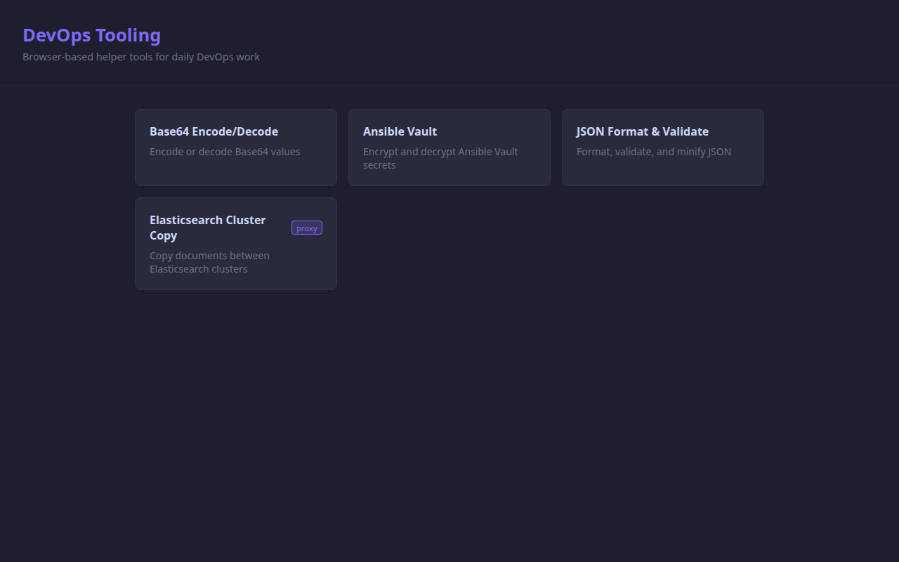
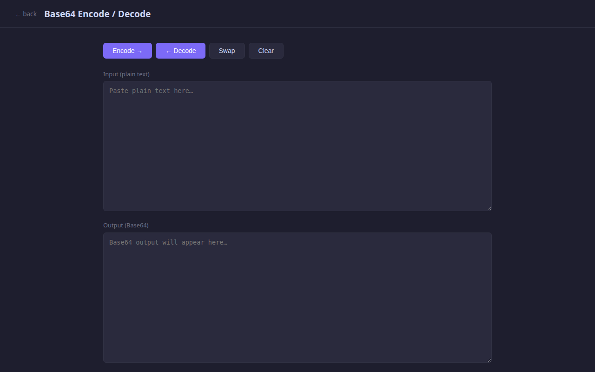
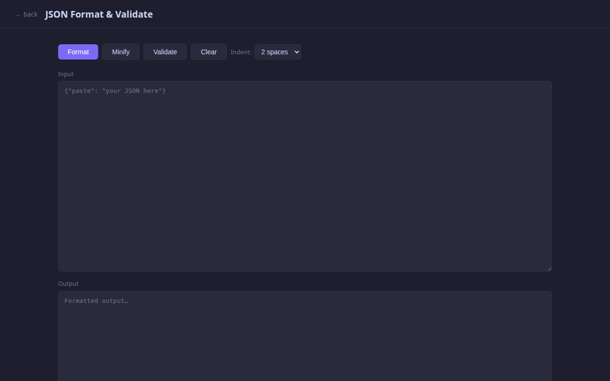

# DevOps Tooling

Browser-based helper tools for daily DevOps work — each tool is a single, self-contained HTML file with no build step required.



**Live demo: [mill-coder.github.io/devops-tooling](https://mill-coder.github.io/devops-tooling/)**

## Tools

| Tool | Description |
|------|-------------|
| **Base64 Encode/Decode** | Encode or decode Base64 values, with live auto-encode as you type |
| **Ansible Vault** | Encrypt and decrypt Ansible Vault secrets without a CLI |
| **JSON Format & Validate** | Format, validate, and minify JSON with configurable indent |
| **Elasticsearch Cluster Copy** | Copy documents between Elasticsearch clusters (requires backend proxy) |

### Base64 Encode / Decode



### JSON Format & Validate



## Quick Start

**With backend** (needed for proxy tools like Elasticsearch copy):

```bash
# Python venv (or: direnv allow if you use direnv)
python3 -m venv .venv && source .venv/bin/activate
pip install -r requirements.txt
python app.py        # http://localhost:5000
```

**Without backend** — open any tool directly in your browser:

```bash
xdg-open tools/base64.html
```

All tools work via `file://` except those that need the CORS proxy (marked `proxy` on the home page).

## Docker

```bash
docker build -t devops-tooling .
docker run -p 5000:5000 devops-tooling
```

## Architecture

- **One tool = one HTML file** in `tools/` — all CSS and JS are inline, no external dependencies at runtime.
- **`tools.json`** — the registry that drives the home page. Add an entry here when creating a new tool.
- **`app.py`** — optional Flask backend. Serves the pages and provides a CORS proxy for tools that call external APIs.
- **GitHub Pages compatible** — `index.html` and `tools/` can be published as-is; the backend is only needed for proxy features.

## Adding a Tool

1. Create `tools/<name>.html` following the conventions in [`doc/tool-conventions.md`](doc/tool-conventions.md).
2. Register it in [`tools.json`](tools.json) — see [`doc/tools-json.md`](doc/tools-json.md) for the schema.
3. Test it via `file://` before relying on the backend.

## Docs

| Topic | File |
|-------|------|
| Tool authoring conventions | [doc/tool-conventions.md](doc/tool-conventions.md) |
| `tools.json` schema | [doc/tools-json.md](doc/tools-json.md) |
| Backend routes and proxy | [doc/backend.md](doc/backend.md) |
| Local dev setup | [doc/dev-setup.md](doc/dev-setup.md) |
| Docker & GitHub Pages deployment | [doc/deployment.md](doc/deployment.md) |
